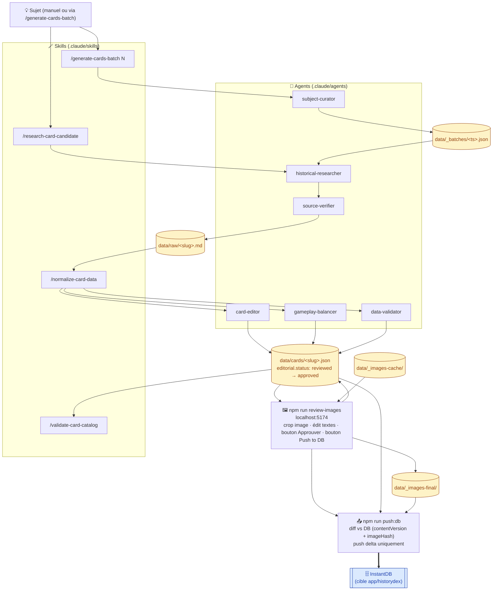

# HistoryDex — Catalog Pipeline

Pipeline éditorial pour produire et valider le catalogue de cartes HistoryDex.

## Quoi

Ce repo produit l'entité `cards` ingérée par l'app HistoryDex (`../app/historydex/`). Il :

- héberge la **vérité éditoriale** d'une carte (sources, justifications, statut, traduction-ready) ;
- valide automatiquement les **invariants gameplay** (ères, régions, paliers de tolérance, sources minimales) ;
- pousse vers InstantDB via un **diff incrémental** (uniquement les cartes nouvelles ou modifiées).

Les briefs d'origine sont conservés dans [data_et_prompts/](data_et_prompts/).

## Vue d'ensemble



**Lecture** : flèches pleines = flux d'artefacts ; doubles (`==>`) = sortie hors-repo ; cylindres = états persistés sur disque.

## Premier démarrage (setup initial)

À faire **une seule fois**, avant le premier push :

```bash
# 1. Installer les dépendances
npm install

# 2. Copier les credentials InstantDB depuis l'app
cp ../app/historydex/.env .env
# (ou éditer .env.example et coller EXPO_PUBLIC_INSTANT_APP_ID + INSTANT_APP_ADMIN_TOKEN)

# 3. Pousser le schéma DB à jour (ajoute contentVersion + imageHash)
cd ../app/historydex && npx instant-cli push schema && cd -

# 4. Vider la table cards (taper "WIPE" pour confirmer)
npm run wipe-db

# 5. Premier push : envoie tout le catalogue approved + images en DB
npm run push:db -- --dry-run    # vérifie le plan
npm run push:db                  # push réel (~3 min pour 200 cartes)
```

À partir de là, la chaîne quotidienne se limite aux skills (`/generate-cards-batch`, etc.) et au push incrémental (`npm run push:db` ou le bouton dans l'app de review).

## Commandes

| Commande | Effet |
|---|---|
| `npm run validate` | Schéma + invariants sur `data/cards/`. Exit 1 si erreur bloquante. Rapport : `reports/validation-<ts>.md`. |
| `npm run report` | Distribution (ère, région, type, tag, status). Rapport : `reports/catalog-<ts>.md`. |
| `npm run check` | `validate && report` enchaînés. |
| `npm run check-subject -- "<sujet>"` | Anti-doublon : cherche le sujet dans `data/cards/` + `data/raw/`. |
| `npm run normalize -- <file>` | Utilitaire CLI : raw JSON → `data/cards/<id>.json`. |
| `npm run fetch-images` | Télécharge les images Wikipedia → `data/_images-cache/`. Idempotent. |
| `npm run process-images` | Auto-crop batch (sharp `position:"attention"`) → `data/_images-final/`. Alternative au crop interactif. |
| `npm run review-images` | Lance l'app de review sur `http://localhost:5174` (crop + édition + Approuver + Push to DB). |
| `npm run push:db` | Push intelligent vers InstantDB (diff vs DB, delta uniquement). |
| `npm run push:db -- --dry-run` | Affiche le plan de push sans rien envoyer. |
| `npm run push:db -- --max-dex N` | Restreint le push aux dexNum ≤ N. |
| `npm run wipe-db` | ⚠️ Vide la table `cards` en DB. Double confirmation (taper « WIPE »). |

## Workflow d'ajout d'une carte

Workflow détaillé dans [docs/workflow.md](docs/workflow.md). Version courte :

### Option A — Génération batch (10 cartes d'un coup)

```
1. /generate-cards-batch 10
   → subject-curator analyse les lacunes du catalogue
   → choisit 10 sujets cohérents (cercle 1/2/3/4 selon la taille du catalogue)
   → écrit data/_batches/<ts>.json (manifest)
   → confirmation utilisateur sur la liste
   → lance research + normalize × 10 en parallèle (par lots de 3)
   → fetch-images, validate final
   → 10 cartes dans data/cards/ au statut "reviewed"

2. npm run review-images
   → review visuelle + recadrage image + clic "✓ Approuver" pour chaque carte
   → bouton "Push to DB" → modal dry-run → confirme → push delta
```

### Option B — Sujet unique (manuel)

```
1. /research-card-candidate "<sujet>"
   → produit data/raw/<slug>.md (sources + vérification + confidence)

2. /normalize-card-data <slug>
   → produit data/cards/<slug>.json (status: reviewed)

3. npm run fetch-images
   → télécharge l'image source dans data/_images-cache/

4. npm run review-images
   → crop, édit textes, clic "Approuver" → status: approved
   → bouton "Push to DB" → push delta vers InstantDB
```

## Statuts éditoriaux

| Status | Sens | Transition |
|---|---|---|
| `draft` | Squelette créé, sources incomplètes. | Rare, transitoire pendant `/normalize-card-data`. |
| `reviewed` | Pipeline complet OK, attend lecture humaine. | Sortie standard de `/normalize-card-data`. |
| `approved` | Lecture humaine OK, prêt à pousser. | Bouton « ✓ Approuver » dans l'app de review (ou `auto-promote --apply` en batch). |
| `archived` | Carte retirée du catalogue (gardée pour historique). | Édition JSON manuelle. |

**Pré-conditions pour passer en `approved`** (vérifiées par le bouton Approuver + `auto-promote.ts`) :
- Validation Zod OK
- ≥ 2 publishers distincts dans `editorial.sources`
- ≥ 1 source `relevance="date"`, ≥ 1 source `relevance="place"`
- `confidence ≠ low`
- Crop d'image appliqué (uniquement côté app de review, pas en batch CLI)
- Aucune erreur bloquante d'invariant

## App de review (`npm run review-images`)

UI web sur `http://localhost:5174`. Trois colonnes :

1. **Sidebar** — liste des cartes triées par `dexNum`, avec :
   - Badge de statut crop (pending / OK / error).
   - Tag éditorial coloré : 🟠 `reviewed` (à reviewer) · 🟢 `approved`.
   - Filtres : « Image cropée / non cropée » + dropdown « Statut éditorial : Tous / À reviewer / Approuvées ».

2. **Éditeur image** — image source, rectangle de crop draggable (ratio 1.37 paysage), trois aperçus simultanés (zoom HDCard, mini collection, thumb strip) qui simulent le rendu côté app. Boutons : `Centrer`, `Reset`, `Enregistrer crop`, `✓ Approuver`, `↩ Revenir en review`, `⤴ Remplacer image`.

3. **Panneau métadonnées** — édition Zod-validée :
   - Texte : `title`, `blurb`, `body`, `imageLabel`, `placeLabel`, `timeDisplayLabel`.
   - Prompts : `wherePrompt.{pre, verb, post}`, `whenPrompt.{pre, verb, post}`.
   - Géo : `lat`, `lon`, `whereRadiusKm` (paliers cliquables) avec carte Leaflet draggable.
   - Temporalité : `tag`, `timeKind`, `pivotYear`, `startYear`, `endYear`, justification.
   - `whenDelta` affiché en read-only (dérivé de l'ère, géré côté serveur).
   - Bouton « Enregistrer » désactivé tant qu'aucun champ n'est modifié (dirty tracking).

**Bouton « ✓ Approuver »** :
- Sauve d'abord les métadonnées dirty si besoin.
- Sauve le crop si modifié.
- Appelle `POST /api/cards/:dexNum/approve` qui vérifie les pré-conditions et flip `editorial.status: approved`.
- Si une pré-condition échoue (422), affiche la liste des bloqueurs dans une alerte (« manque 1 source `place` », « image non rognée »…).

**Bouton « Push to DB »** dans le header :
- Modal en 2 étapes : (1) dry-run automatique affiche le diff (`X new, Y updated, Z image-changed, W unchanged`), (2) case à cocher « Je confirme » → bouton actif → push réel avec barre de progression (polling 700ms).
- Toast vert/rouge à la fin + log des erreurs détaillé si rouge.

## Push intelligent (`npm run push:db`)

Logique :

1. Charge `data/cards/` filtré sur `editorial.status === "approved"`.
2. Vérifie les invariants bloquants — refuse de pousser si rouge.
3. Fetch toutes les cartes en DB (récupère `dexNum`, `contentVersion`, `imageHash`).
4. Calcule le diff :
   - **New** : `dexNum` absent de la DB.
   - **Text-updated** : `local.contentVersion > db.contentVersion`.
   - **Image-changed** : `sha256(_images-final/<dexNum>.jpg) ≠ db.imageHash`.
   - **Unchanged** : skip.
5. Push texte en une seule transaction. Push images séquentiel (~1/sec à cause du rate-limit InstantDB).
6. Met à jour `contentVersion` + `imageHash` en DB pour le prochain diff.

Idempotent : relancer immédiatement → « X unchanged, rien à faire ».

Pour reset la DB et tout re-pousser : `npm run wipe-db && npm run push:db`.

## Structure du repo

| Dossier | Rôle |
|---|---|
| `schemas/` | Sources de vérité Zod (`card.schema.ts`, `catalog.schema.ts`). |
| `scripts/` | Scripts TypeScript actifs + `_lib/` (helpers partagés). |
| `scripts/archive/` | Scripts one-shot historiques (non-fonctionnels après la migration mai 2026). |
| `data/candidates/` | Listes de sujets potentiels (markdown libre). |
| `data/raw/` | Fiches brutes produites par `historical-researcher` (gitignorées). |
| `data/cards/` | **Source unique du catalogue.** JSON conforme Zod. Statut éditorial dans `editorial.status`. |
| `data/_batches/` | Manifests `subject-curator` (gitignoré). |
| `data/_images-cache/` | Images source Wikipedia + `_index.json` (gitignorés). |
| `data/_images-final/` | Crops 800×584 prêts à uploader (gitignorés). |
| `reports/` | Rapports horodatés (validation, distribution, push). |
| `.claude/rules/` | Règles éditoriales / recherche / validation. |
| `.claude/agents/` | Subagents (researcher, verifier, editor, balancer, validator, subject-curator). |
| `.claude/skills/` | Skills user-invocables (`/research-card-candidate`, `/normalize-card-data`, `/validate-card-catalog`, `/generate-cards-batch`). |
| `docs/` | Workflow, source-policy, editorial-guidelines (lecture humaine). |
| `data_et_prompts/` | Briefs d'origine. |

## Limites connues / décisions humaines

- **Promotion à `approved` est humaine** : le pipeline produit `reviewed`, l'humain valide visuellement (ton, crop, neutralité).
- **Mapping `country` ISO → FR** dans [scripts/_lib/country-fr.ts](scripts/_lib/country-fr.ts) ; à compléter quand un fallback apparaît dans le rapport de push.
- **Champs perdus côté DB** : `placeKind`, `placeLabel`, `aliases`, `editorial.sources` ne sont pas ingérés par l'app aujourd'hui. À prévoir dans une évolution future du schéma InstantDB.
- **i18n `en` non actif** : le format des locales le permet, l'export ne le consomme pas encore.
